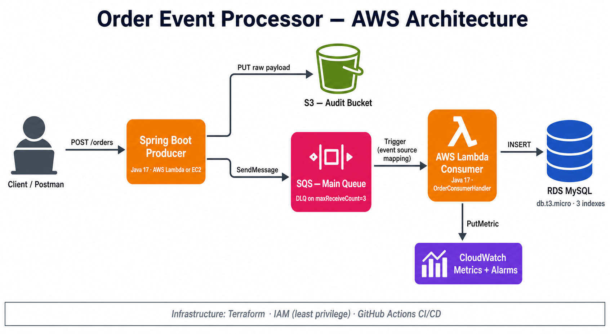

# Order Event Processor

Event-driven order ingestion and processing pipeline on AWS — Spring Boot REST API publishes order events to SQS; a Lambda consumer processes them asynchronously and persists to RDS MySQL. Audit copies are written to S3 for replay. Fully provisioned via Terraform.

## Stack

- **Producer:** Java 17, Spring Boot 3, Maven
- **Consumer:** Java 17 AWS Lambda (shaded fat-jar)
- **Async layer:** Amazon SQS (main queue + DLQ, maxReceiveCount=3)
- **Persistence:** Amazon RDS MySQL 8 (db.t3.micro)
- **Audit storage:** Amazon S3 (raw payload archive)
- **Observability:** Amazon CloudWatch (custom metrics + alarms)
- **Security:** IAM roles per service, least-privilege policies
- **IaC:** Terraform (AWS provider)
- **CI/CD:** GitHub Actions (build on PR, deploy on merge to main)

## API

POST /orders

Request body:

    {
      "customerId": "C-1042",
      "items": [
        { "sku": "SKU-001", "quantity": 2, "unitPriceCents": 1999 },
        { "sku": "SKU-007", "quantity": 1, "unitPriceCents": 4999 }
      ]
    }

Response: 202 Accepted with the generated orderId.

## Architecture decisions

- **SQS over Kafka:** managed, no broker to operate, sufficient throughput for the workload. Kafka would be the right choice at higher fan-out or multi-consumer scale.
- **Lambda over ECS/Fargate:** scale-to-zero, no idle cost, fits a bursty ingestion workload. ECS would be the right choice for sustained high-throughput or long-running processing.
- **Dead-letter queue with maxReceiveCount=3:** isolates poison-pill messages after three failed processing attempts to protect downstream throughput.
- **Per-service IAM roles:** the producer can only sqs:SendMessage and s3:PutObject; the consumer can only sqs:ReceiveMessage, sqs:DeleteMessage, and write to RDS. No shared role, no wildcard policies.
- **Custom CloudWatch metric OrdersProcessed:** emitted from the Lambda consumer; alarms on error rate above 5% over a 5-minute window.

## Local development

    cd producer && mvn clean verify && cd ..
    cd consumer && mvn clean package && cd ..

## Deploy

    cd terraform
    cp terraform.tfvars.example terraform.tfvars
    terraform init
    terraform apply

After apply, the producer can be deployed to EC2 or ECS using the artifact in producer/target/. The consumer Lambda is built and uploaded automatically by .github/workflows/deploy.yml on push to main.

## Repo layout

    producer/        Spring Boot REST API
    consumer/        AWS Lambda SQS consumer
    terraform/       Full AWS infrastructure (SQS, Lambda, RDS, S3, IAM, CloudWatch)
    .github/         CI/CD workflows
    docs/            Architecture diagram and design notes

## License

MIT
